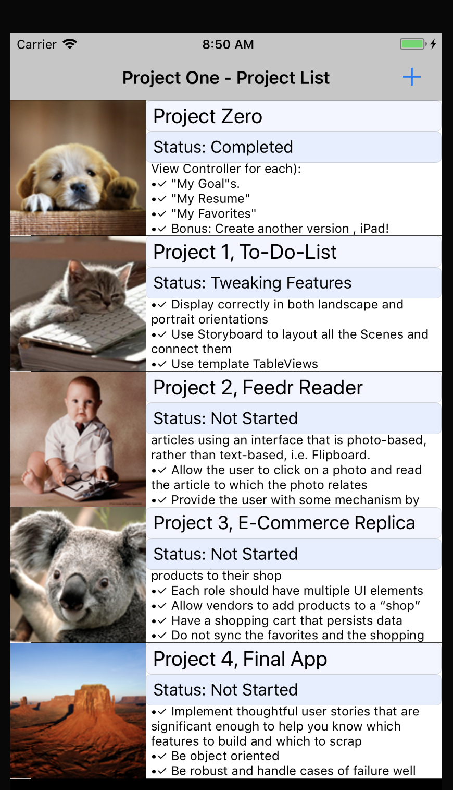
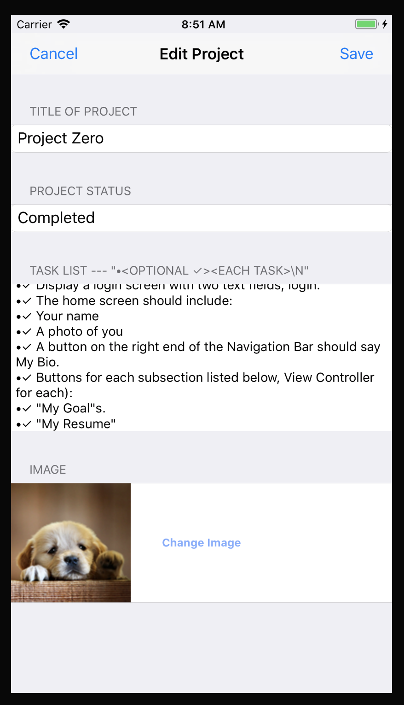
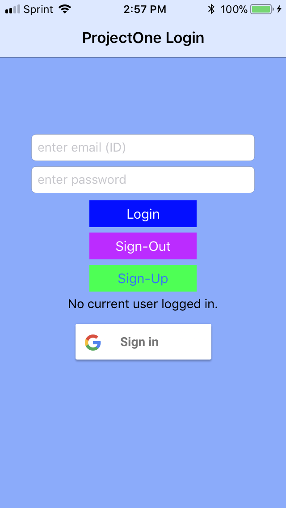
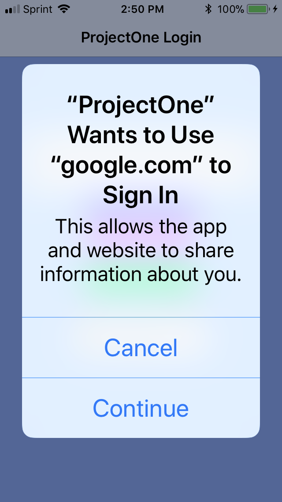

## This Project is a To-Do List of the projects of this class (GA iOS immersion) with Firebase Auth and Google login added as an exercise later.
- The list of project can be edited, deleted, moved up/down, and appended. Each project has a list of tasks(On Edit Project Screen and Add Project Screen), which can be edited. the save will automatically edit the task list with bullet and check mark(task done).
- will Add a project, clicking on project will Edit a project.
Swiping left on Project gives MoveUp, MoveDown, Delete options using Action buttons.
- Main Screen - Screen-Shot-Initial-Project-List -
# 

- Edit Screen(Add screen looks the same) - Screen-Shot-Edit-Screen -
# 

- Login Screen with Google Sign In -
# 

# 

Note: Prototype included in PDF/Note file called "ProjectOneFB".

Firebase auth code added and GoogleSignIn.
